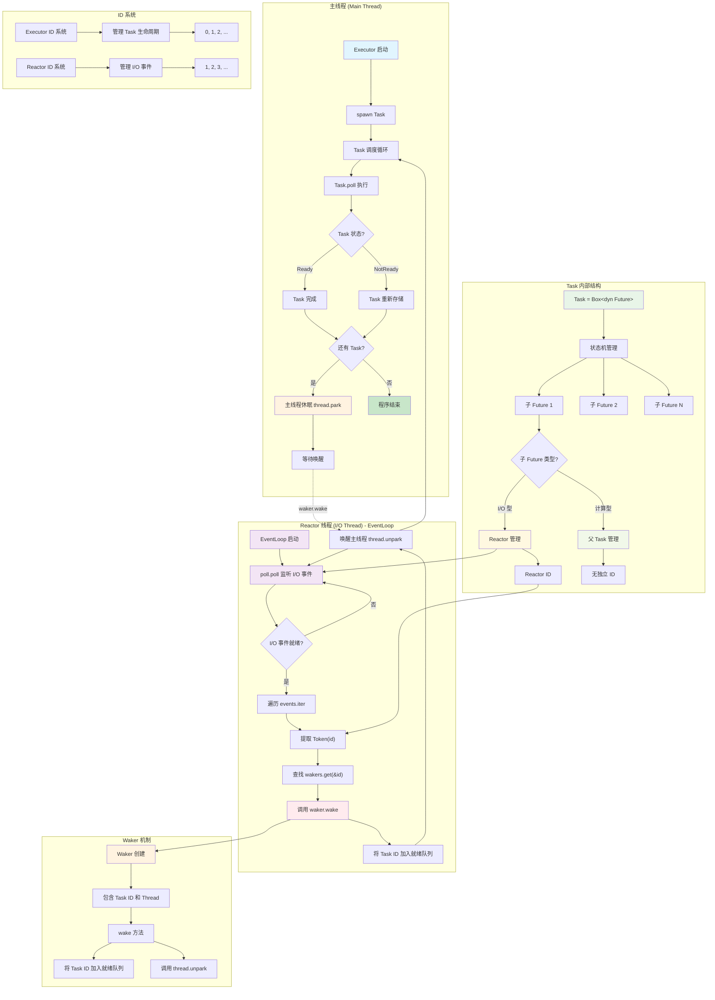
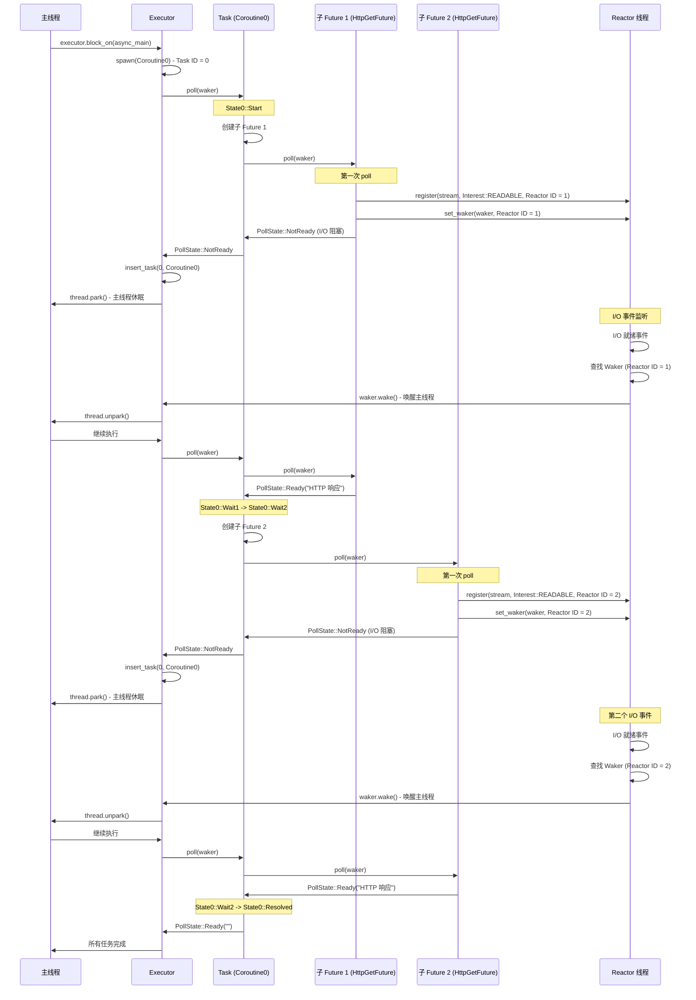
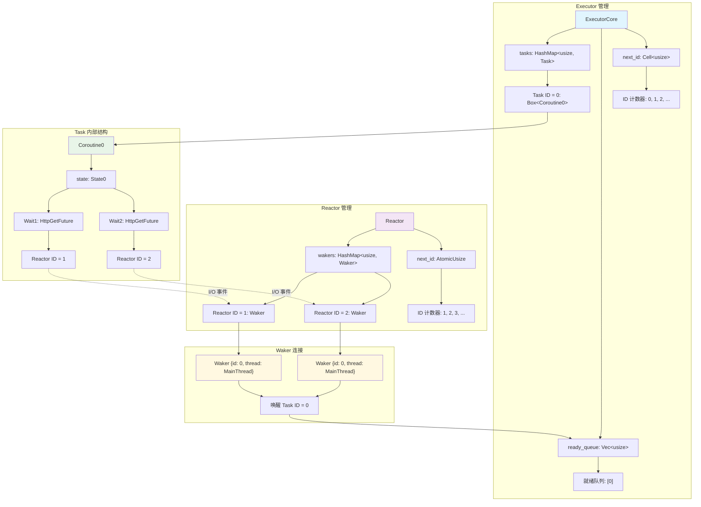
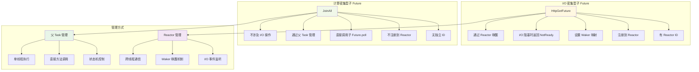

# 异步运行时系统架构图表


本文档包含了 Rust 异步运行时系统的详细架构图表，展示了 Task、子 Future、Executor、Reactor 等核心概念的关系和执行流程。

## 整体架构概览



## Task 和子 Future 详细执行流程



## 数据结构和关系图



## 子 Future 管理方式对比



## 核心概念总结

### Task 和 Future 的关系

- **Task** = `Box<dyn Future<Output = String>>`（类型别名）
- **Task** 强调**可调度性**：被 Executor 管理的执行单元
- **Future** 强调**异步性**：异步计算的抽象
- **一个 Task 可以包含多个子 Future**

### 层次结构

```
Task (Coroutine0) - Executor ID = 0
├── 子 Future 1 (HttpGetFuture) - Reactor ID = 1
│   └── 执行: HTTP 请求 "/600/HelloAsyncAwait"
└── 子 Future 2 (HttpGetFuture) - Reactor ID = 2
    └── 执行: HTTP 请求 "/400/HelloAsyncAwait"
```

### 管理方式

**Task 管理**：
- 被 Executor 直接管理和调度
- 有唯一的 Executor ID
- 存储在 `tasks` HashMap 中
- 可以被暂停、恢复、完成

**子 Future 管理**：
- 被父 Task 内部管理
- 通过状态机控制执行顺序
- I/O 型有自己的 Reactor ID（用于 I/O 事件）
- 计算型无独立 ID，通过父 Task 直接管理

### ID 系统设计

**两套独立的 ID 系统**：

1. **Executor ID 系统**：
   - 管理所有 Future 任务的生命周期
   - 用于任务调度和存储
   - 在单线程环境中使用（线程安全）

2. **Reactor ID 系统**：
   - 管理 I/O 事件和 Waker 的映射
   - 用于跨线程通信（Reactor 在独立线程中运行）
   - 需要线程安全的 ID 生成

### 子 Future 分类

**I/O 密集型子 Future**：
- 通过 Reactor 管理
- 有 Reactor ID
- 需要异步 I/O 操作
- 例子：`HttpGetFuture`、文件操作 Future

**计算密集型子 Future**：
- 通过父 Task 直接管理
- 无独立 ID
- 纯计算，不涉及 I/O
- 例子：`JoinAll`、数学计算 Future

### 设计优势

**单 Task + 多子 Future 模式**：
- **顺序执行**：子 Future 按状态机顺序执行
- **状态管理**：通过状态机管理多个子 Future
- **资源效率**：只需要管理一个 Task
- **简单性**：避免复杂的多 Task 调度

这种设计实现了**单任务 + 状态机**的协程模式，既保持了简单性，又支持了复杂的异步操作组合。
