# b-reactor-executor 项目 Mermaid 流程图

## 1. 原始单线程架构流程图

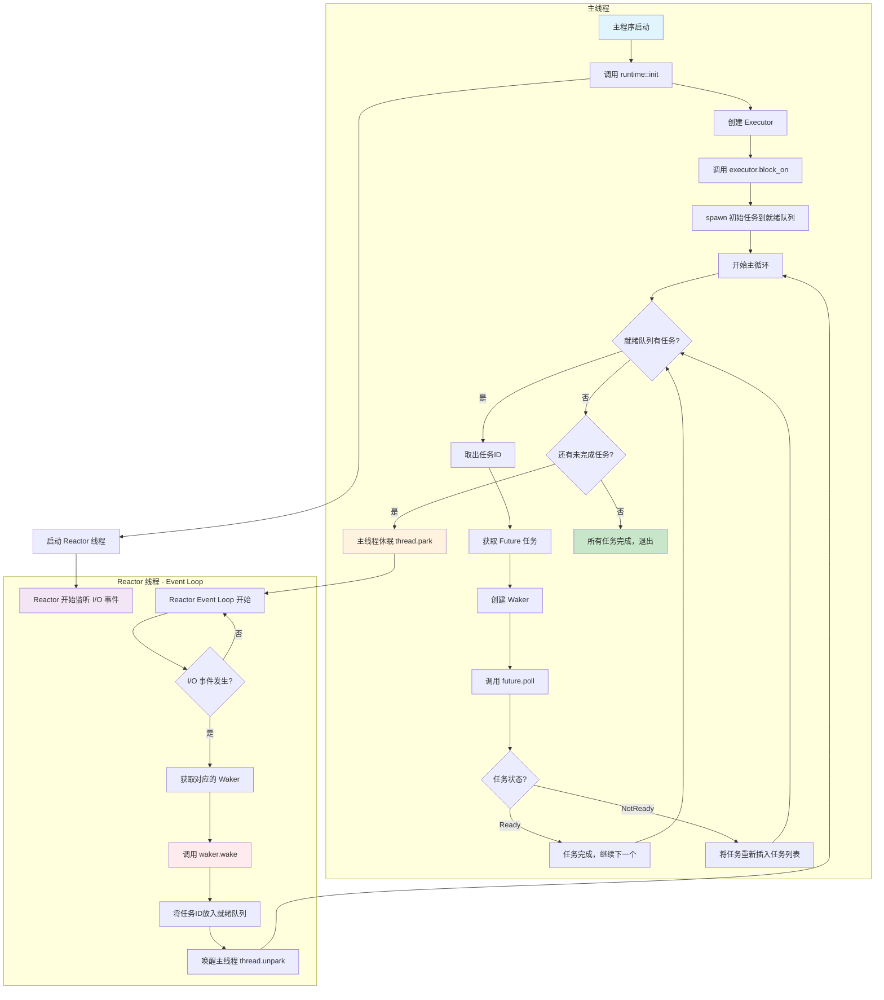

## 2. 高级多线程架构流程图

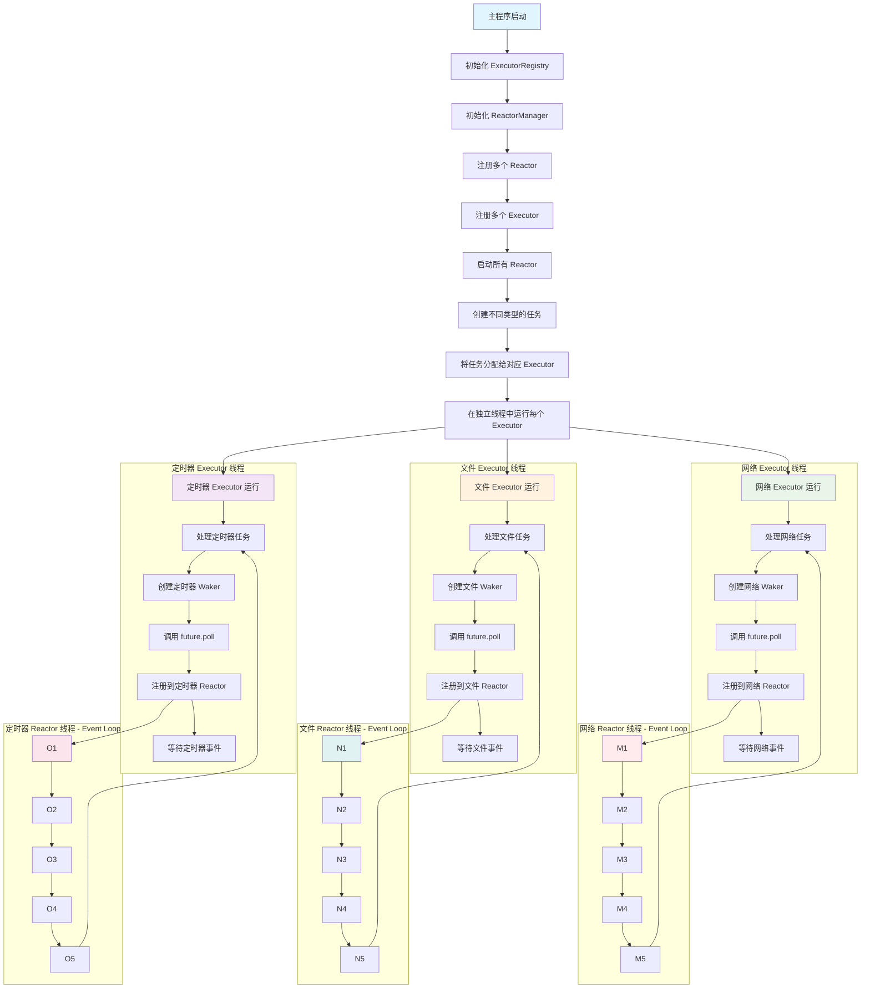

## 3. 核心组件交互图

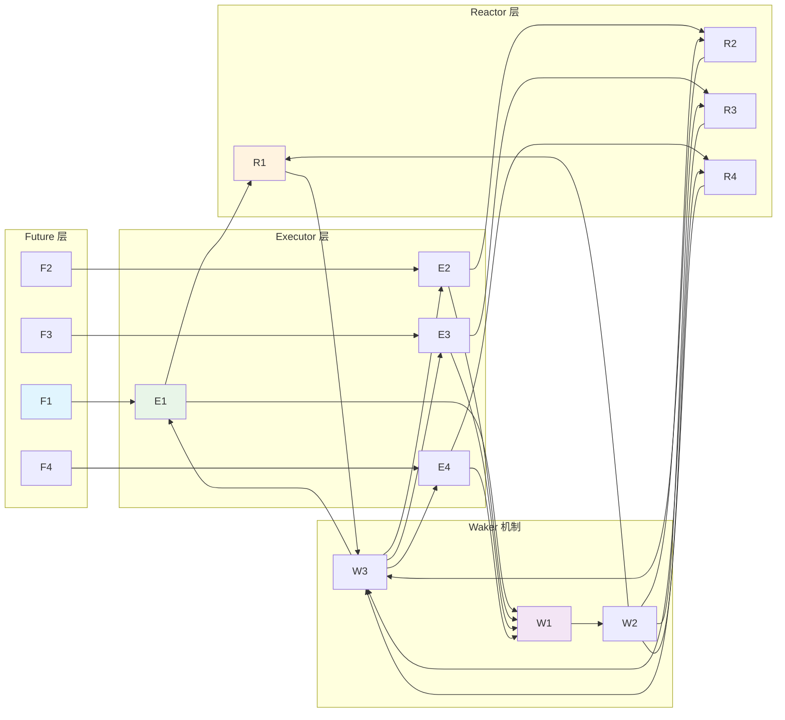

## 4. 数据流图

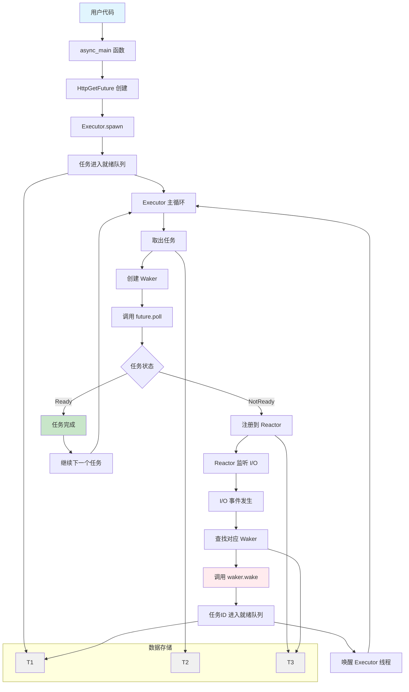

## 5. 时序图

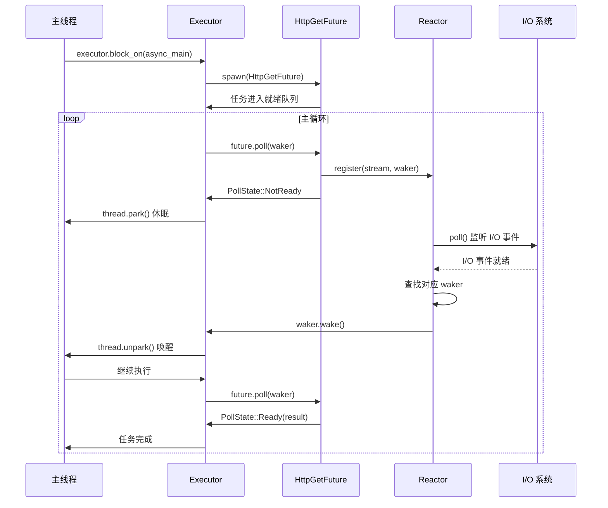

## 6. 系统架构概览图

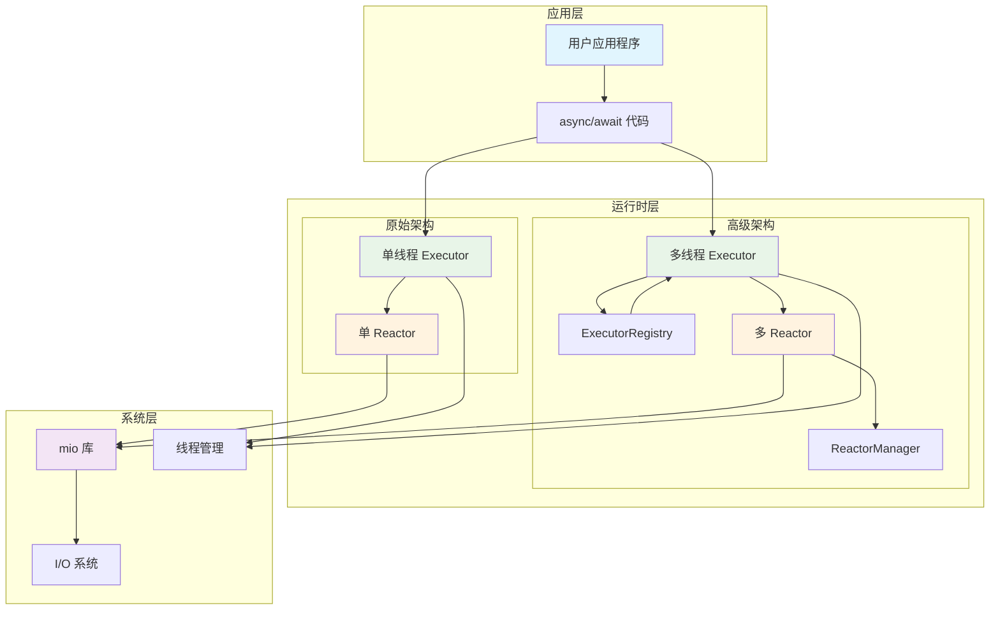

## 7. Waker 生命周期图

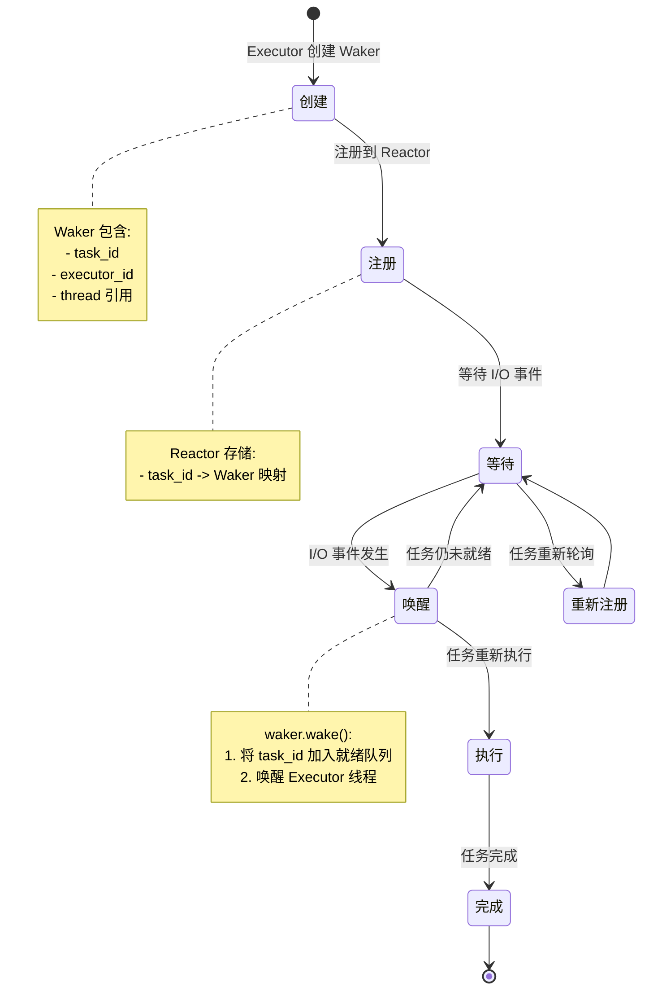

## 8. Event Loop 详细流程图

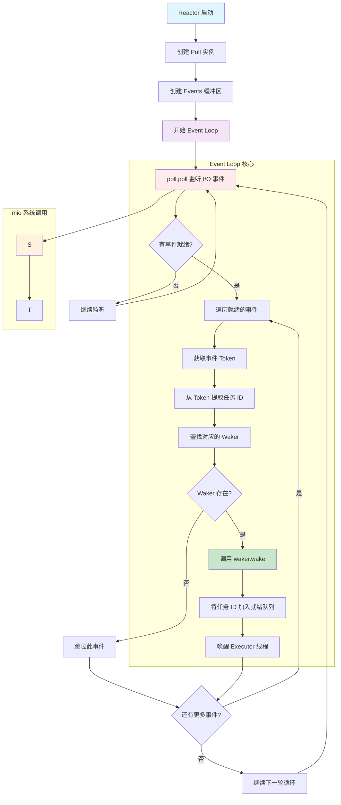

## 9. Event Loop 与 Executor 交互时序图

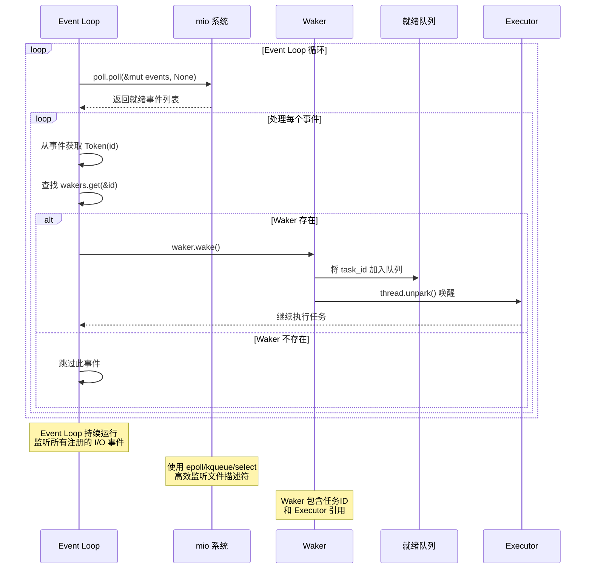

## 10. Event Loop 核心代码流程图

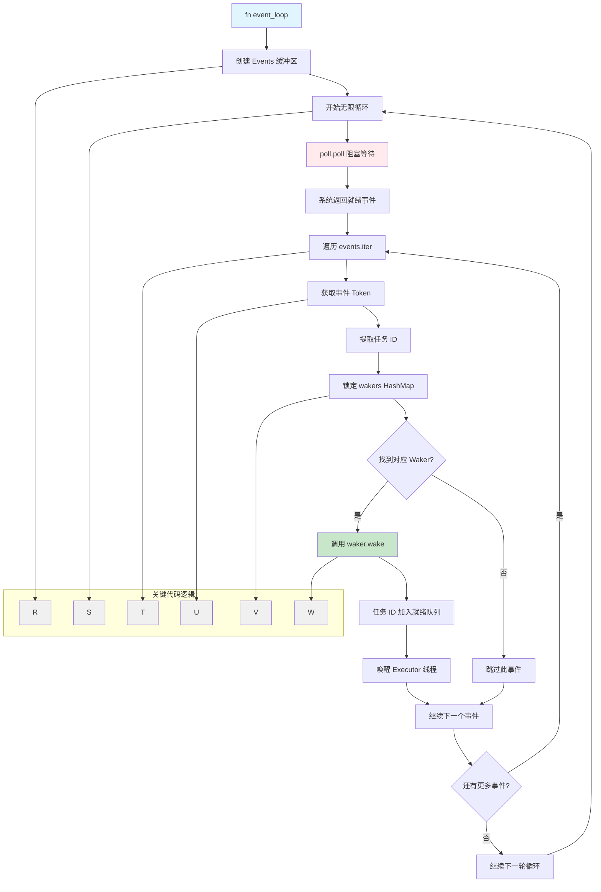

## 11. 任务状态转换图

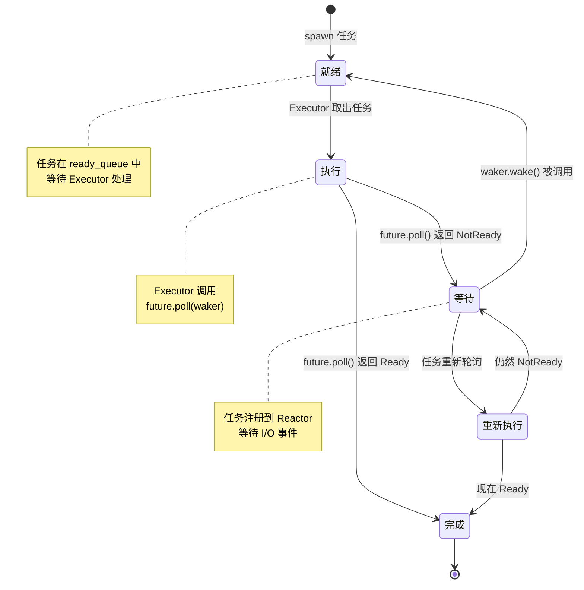

这些 Mermaid 图表展示了 b-reactor-executor 项目的完整架构和执行流程，包括：

1. **原始单线程架构** - 展示主线程和Reactor线程的交互
2. **高级多线程架构** - 展示多个Executor和Reactor的并行执行
3. **核心组件交互** - 展示各组件间的关系
4. **数据流** - 展示数据在系统中的流动
5. **时序图** - 展示异步任务的执行时序
6. **系统架构概览** - 整体架构视图
7. **Waker 生命周期** - Waker 的创建、注册、唤醒过程
8. **任务状态转换** - 任务在不同状态间的转换

你可以直接复制这些 Mermaid 代码到支持 Mermaid 的编辑器中查看渲染结果！
