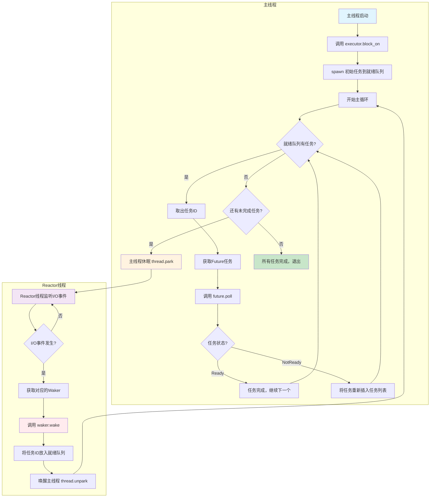

# Rust 异步运行时系统分析

这是一个手写实现的 Rust 异步运行时系统，展示了异步编程的核心概念和实现原理。项目实现了类似 Tokio 的异步运行时架构，采用**单线程执行器 + 多线程 I/O 监听**的设计模式。

## 项目架构

### 模块结构

- **`src/main.rs`** - 主程序入口，演示异步编程使用方式
- **`src/future.rs`** - Future trait 定义和状态管理
- **`src/runtime.rs`** - 运行时模块统一入口
- **`src/runtime/executor.rs`** - 执行器核心，负责任务调度和执行
- **`src/runtime/reactor.rs`** - 事件反应器，处理 I/O 事件和唤醒机制
- **`src/http.rs`** - HTTP 客户端实现，展示异步 I/O 应用

### 核心设计模式

1. **Reactor-Executor 模式**

   - **Reactor**: 负责 I/O 事件监听和 Waker 唤醒
   - **Executor**: 负责任务调度和执行

2. **Waker 机制**

   - 实现异步任务的唤醒机制
   - 当 I/O 事件发生时，通过 Waker 唤醒对应的任务

3. **状态机模式**
   - 将 async/await 语法转换为显式的状态机
   - 每个状态对应 Future 执行的不同阶段

## 执行模型分析

### 双线程架构

- **主线程（Main Thread）**: 运行 `executor.block_on(async_main())`，负责执行所有的 Future 任务
- **Reactor 线程**: 运行 `event_loop`，专门负责 I/O 事件监听

### 关键点：Waker 绑定的是主线程

```rust
// 在executor.rs中创建Waker时
fn get_waker(&self, id: usize) -> Waker {
    Waker {
        id,
        thread: thread::current(), // 这里记录的是主线程！
    }
}
```

## 完整的执行周期

1. **主线程启动**: 调用 `executor.block_on(async_main())`
2. **第一轮执行**: 处理所有 ready 的任务，收集 unready 的任务
3. **主线程休眠**: 如果还有 unready 任务，调用 `thread::park()` 休眠
4. **Reactor 监听**: 在独立线程中监听 I/O 事件
5. **事件触发**: 当 I/O 事件发生时，调用 `waker.wake()`
6. **主线程唤醒**: `waker.wake()` 将任务 ID 放入就绪队列，并唤醒主线程
7. **继续执行**: 主线程从 `thread::park()` 醒来，继续下一轮任务处理
8. **循环往复**: 重复步骤 2-7，直到所有任务完成

## 执行流程图



## 代码执行流程详解

### 1. 主线程负责任务执行，在 `block_on` 方法中

```rust
// 主线程调用
fn main() {
    let mut executor = runtime::init();
    executor.block_on(async_main()); // 主线程在这里执行
}
```

### 2. Executor 的 loop 处理 ready 任务，收集 unready 任务

```rust
pub fn block_on<F>(&mut self, future: F) {
    spawn(future);
    loop {
        // 第一轮：处理所有ready的任务
        while let Some(id) = self.pop_ready() {
            let mut future = match self.get_future(id) {
                Some(f) => f,
                None => continue,
            };
            let waker = self.get_waker(id);

            match future.poll(&waker) {
                PollState::NotReady => self.insert_task(id, future), // 收集unready任务
                PollState::Ready(_) => continue, // ready任务完成，继续处理下一个
            }
        }

        // 检查是否还有未完成的任务
        let task_count = self.task_count();
        if task_count > 0 {
            println!("{name}: {task_count} pending tasks. Sleep until notified.");
            thread::park(); // 主线程休眠，等待被唤醒
        } else {
            println!("{name}: All tasks are finished");
            break; // 所有任务完成，退出循环
        }
    }
}
```

### 3. EventLoop 负责 poll，触发 wake 唤醒主线程

```rust
// Reactor线程运行event_loop
fn event_loop(mut poll: Poll, wakers: Wakers) {
    let mut events = Events::with_capacity(100);
    loop {
        poll.poll(&mut events, None).unwrap(); // 监听I/O事件
        for e in events.iter() {
            let Token(id) = e.token();
            let wakers = wakers.lock().unwrap();

            if let Some(waker) = wakers.get(&id) {
                waker.wake(); // 触发wake，唤醒主线程
            }
        }
    }
}

// Waker的wake方法
impl Waker {
    pub fn wake(&self) {
        // 将任务ID放入就绪队列
        READY_QUEUE.get().unwrap()
            .lock()
            .map(|mut q| q.push(self.id))
            .unwrap();
        // 唤醒主线程
        self.thread.unpark();
    }
}
```

## 设计优缺点

### 优点

- 避免了任务间的竞争条件
- 简化了并发控制
- 适合 I/O 密集型应用
- 实现了高效的异步 I/O 处理，避免了忙等待

### 缺点

- 无法利用多核 CPU 进行任务并行执行
- 如果某个任务计算密集，会阻塞其他任务
- 单线程执行模型限制了性能扩展性

## 高级架构设计思想

### Executor 和 Reactor 解耦的优势

这段文字描述了一个**更加灵活和可扩展的异步运行时架构**：

1. **解耦设计**: Executor 和 Reactor 通过 Waker 间接通信，没有直接依赖
2. **多 Executor 支持**: 可以运行多个 Executor 线程，每个处理自己的任务
3. **共享 Reactor**: 多个 Executor 可以共享同一个 I/O 监听器
4. **多 Reactor 支持**: 不同类型的 I/O 可以由专门的 Reactor 处理
5. **精确唤醒**: 每个 Reactor 知道应该唤醒哪个 Executor

### 两条核心规则

#### 规则 1: 多 Executor + 共享 Reactor

```
Thread 1: Executor A ─┐
Thread 2: Executor B ─┼─→ 共享Reactor ←─ I/O事件
Thread 3: Executor C ─┘
```

**优势**:

- 多个执行器可以并行处理任务
- 所有执行器共享同一个 I/O 监听器
- 避免了重复的 I/O 监听开销

#### 规则 2: 多 Reactor + 精确唤醒

```
Reactor A (网络I/O) ──→ Executor X
Reactor B (文件I/O) ──→ Executor Y
Reactor C (定时器)  ──→ Executor Z
```

**优势**:

- 不同类型的 I/O 由专门的 Reactor 处理
- 每个 Reactor 知道应该唤醒哪个 Executor
- 实现了 I/O 类型的专业化处理

### 实现示例

#### 1. 多 Executor + 共享 Reactor 架构

```rust
// Executor注册表
pub struct ExecutorRegistry {
    executors: HashMap<ExecutorId, Arc<dyn TaskExecutor>>,
}

impl ExecutorRegistry {
    pub fn register_executor(&mut self, id: ExecutorId, executor: Arc<dyn TaskExecutor>) {
        self.executors.insert(id, executor);
    }

    pub fn get_executor(&self, id: ExecutorId) -> Option<&Arc<dyn TaskExecutor>> {
        self.executors.get(&id)
    }
}

// 改进后的Waker设计
pub struct Waker {
    id: usize,
    executor_id: ExecutorId,  // 指定唤醒哪个Executor
}

impl Waker {
    pub fn wake(&self) {
        // 通过executor_id找到对应的Executor
        EXECUTOR_REGISTRY.get_executor(self.executor_id)
            .wake_task(self.id);
    }
}
```

#### 2. 多 Reactor 架构

```rust
// 网络I/O Reactor
pub struct NetworkReactor {
    wakers: Arc<Mutex<HashMap<usize, Waker>>>,
    registry: Registry,
}

impl NetworkReactor {
    pub fn handle_network_event(&self, event: Event) {
        let Token(id) = event.token();
        if let Some(waker) = self.wakers.lock().unwrap().get(&id) {
            // 网络事件 -> 唤醒处理网络任务的Executor
            waker.wake();
        }
    }
}

// 文件I/O Reactor
pub struct FileReactor {
    wakers: Arc<Mutex<HashMap<usize, Waker>>>,
}

impl FileReactor {
    pub fn handle_file_event(&self, event: FileEvent) {
        if let Some(waker) = self.wakers.lock().unwrap().get(&event.task_id) {
            // 文件事件 -> 唤醒处理文件任务的Executor
            waker.wake();
        }
    }
}

// 定时器Reactor
pub struct TimerReactor {
    wakers: Arc<Mutex<HashMap<usize, Waker>>>,
}

impl TimerReactor {
    pub fn handle_timer_event(&self, event: TimerEvent) {
        if let Some(waker) = self.wakers.lock().unwrap().get(&event.task_id) {
            // 定时器事件 -> 唤醒处理定时任务的Executor
            waker.wake();
        }
    }
}

// Reactor管理器
pub struct ReactorManager {
    reactors: HashMap<ReactorType, Arc<dyn Reactor>>,
}

impl ReactorManager {
    pub fn register_reactor(&mut self, reactor_type: ReactorType, reactor: Arc<dyn Reactor>) {
        self.reactors.insert(reactor_type, reactor);
    }
}
```

### 当前代码的局限性

#### 1. 线程绑定问题

```rust
fn get_waker(&self, id: usize) -> Waker {
    Waker {
        id,
        thread: thread::current(), // 绑定到当前线程，限制了灵活性
    }
}
```

#### 2. 单一 Reactor

```rust
static REACTOR: OnceLock<Reactor> = OnceLock::new();
```

当前代码只支持一个全局的 Reactor，无法处理不同类型的 I/O。

#### 3. 只支持网络 I/O

```rust
pub fn register(&self, stream: &mut TcpStream, interest: Interest, id: usize)
```

Reactor 只能注册 TcpStream，不支持文件、定时器等其他类型的 I/O。

### 多 Reactor 架构的优势

#### 1. 专业化处理

```rust
// 网络I/O需要epoll/kqueue
NetworkReactor::new(epoll_fd)

// 文件I/O需要inotify/fsevents
FileReactor::new(inotify_fd)

// 定时器需要timerfd
TimerReactor::new(timer_fd)
```

#### 2. 精确唤醒

```rust
// 网络事件发生时
NetworkReactor::handle_event() -> 唤醒 Executor A

// 文件事件发生时
FileReactor::handle_event() -> 唤醒 Executor B

// 定时器事件发生时
TimerReactor::handle_event() -> 唤醒 Executor C
```

#### 3. 负载均衡和资源隔离

```rust
// 网络任务重的场景
let network_executor = Executor::new();
let file_executor = Executor::new();

// 网络Reactor专门唤醒网络Executor
// 文件Reactor专门唤醒文件Executor
// 网络I/O不会阻塞文件I/O
// 文件I/O不会阻塞定时器I/O
```

## 总结

这是一个经典的**事件驱动 + 协作式调度**的异步执行模型，通过双线程架构实现了高效的异步 I/O 处理。主线程负责执行所有的 Future 任务，而 Reactor 线程专门负责 I/O 事件监听和唤醒主线程。

**高级架构设计**展示了如何通过解耦 Executor 和 Reactor 来实现：

- **多 Executor + 共享 Reactor**: 实现真正的多线程任务执行
- **多 Reactor + 精确唤醒**: 实现 I/O 类型的专业化处理

这种设计比当前代码更加灵活，可以实现真正的多线程任务执行，同时保持高效的 I/O 处理。当前代码虽然使用了全局就绪队列，但 Waker 仍然绑定到特定线程，限制了扩展性。

这种设计展示了 Rust 异步编程的底层实现原理，是学习 Tokio 等异步运行时内部工作机制的绝佳资源。

## 高级架构 Demo

为了展示多 Executor 和多 Reactor 架构的实际应用，我们还提供了一个完整的高级架构实现：

### 运行方式

```bash
# 运行原始架构演示
cargo run --bin app

# 运行高级架构演示  
cargo run --bin advanced
```

### 高级架构特性

- **多 Executor**: 网络执行器、文件执行器、定时器执行器
- **多 Reactor**: 网络 Reactor、文件 Reactor、定时器 Reactor
- **解耦设计**: Executor 和 Reactor 通过 Waker 间接通信
- **精确唤醒**: 每种类型的 I/O 事件只唤醒对应的 Executor
- **多线程执行**: 每个 Executor 在独立线程中运行

### 文件结构

```
src/
├── advanced_runtime.rs    # 高级运行时实现
├── advanced_main.rs       # 高级架构演示主程序
├── main.rs               # 原始架构演示
└── runtime/              # 原始运行时实现
    ├── executor.rs
    └── reactor.rs
```

详细的使用说明请参考 `ADVANCED_DEMO.md` 文件。
